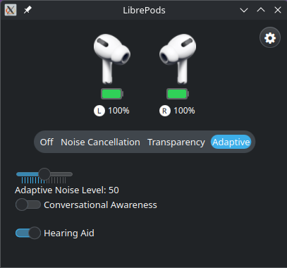

# LibrePods on Linux

A new rewrite is being worked upon. Please look at the list of features in the root README to see what's supported in the new version. 

The rewrite can be found in the `linux/rust` branch [here](https://github.com/kavishdevar/librepods/tree/linux/rust/linux-rust). Follow the development in [PR #241](https://github.com/kavishdevar/librepods/pull/241). 


## Installation

### GitHub Releases

The app is ready to download as an AppImage or an executable. You can download the latest pre-release from the [GitHub releases](https://github.com/kavishdevar/librepods/releases?q="linux-v0").

### Nightly Builds (recommended)

You can also try the latest build of the new version from the [GitHub Actions artifacts](https://github.com/kavishdevar/librepods/actions/workflows/ci-linux-rust.yml). On the latest successful workflow run, download the **librepods-x86_64.AppImage** or **librepods** binary from **Artifacts**.


<details>
  <summary>README for the old version</summary>

# LibrePods Linux



A native Linux application to control your AirPods, with support for:

- Noise Control modes (Off, Transparency, Adaptive, Noise Cancellation)
- Conversational Awareness
- Battery monitoring
- Auto play/pause on ear detection
- Hearing Aid features
   - Supports adjusting hearing aid- amplification, balance, tone, ambient noise reduction, own voice amplification, and conversation boost
   - Supports setting the values for left and right hearing aids (this is not a hearing test! you need to have an audiogram to set the values)
- Seamless handoff between Android and Linux

## Prerequisites

1. Your phone's Bluetooth MAC address (can be found in Settings > About Device)
2. Qt6 packages

   ```bash
   # For Arch Linux / EndeavourOS
   sudo pacman -S qt6-base qt6-connectivity qt6-multimedia-ffmpeg qt6-multimedia

   # For Debian
   sudo apt-get install qt6-base-dev qt6-declarative-dev qt6-connectivity-dev qt6-multimedia-dev \
        qml6-module-qtquick-controls qml6-module-qtqml-workerscript qml6-module-qtquick-templates \
        qml6-module-qtquick-window qml6-module-qtquick-layouts

    # For Fedora
    sudo dnf install qt6-qtbase-devel qt6-qtconnectivity-devel \
        qt6-qtmultimedia-devel qt6-qtdeclarative-devel
   ```
3. OpenSSL development headers

    ```bash
    # On Arch Linux / EndevaourOS, these are included in the OpenSSL package, so you might already have them installed.
    sudo pacman -S openssl
    
    # For Debian / Ubuntu
    sudo apt-get install libssl-dev
    
    # For Fedora
    sudo dnf install openssl-devel
    ```
4. Libpulse development headers

    ```bash
    # On Arch Linux / EndevaourOS, these are included in the libpulse package, so you might already have them installed.
    sudo pacman -S libpulse

    # For Debian / Ubuntu
    sudo apt-get install libpulse-dev

    # For Fedora
    sudo dnf install pulseaudio-libs-devel
    ```
5. Cmake

    ```bash
    # For Arch Linux / EndeavourOS
    sudo pacman -S cmake

    # For Debian / Ubuntu
    sudo apt-get install cmake

    # For Fedora
    sudo dnf install cmake
    ```

## Setup

1. Build the application:

   ```bash
   mkdir build
   cd build
   cmake ..
   make -j $(nproc)
   ```

2. Run the application:

   ```bash
   ./librepods
   ```

## Troubleshooting

### Media Controls (Play/Pause/Skip) Not Working

If tap gestures on your AirPods aren't working for media control, you need to enable AVRCP support. The solution depends on your audio stack:

#### PipeWire/WirePlumber (Recommended)

Create `~/.config/wireplumber/wireplumber.conf.d/51-bluez-avrcp.conf`:

```conf
monitor.bluez.properties = {
  # Enable dummy AVRCP player for proper media control support
  # This is required for AirPods and other devices to send play/pause/skip commands
  bluez5.dummy-avrcp-player = true
}
```

Then restart WirePlumber:

```bash
systemctl --user restart wireplumber
```

> [!WARNING]
> Do NOT run `mpris-proxy` with WirePlumber - it will conflict and break media controls.

#### PulseAudio

If you're using PulseAudio instead of PipeWire, enable and start `mpris-proxy`:

```bash
systemctl --user enable --now mpris-proxy
```

## Usage

- Left-click the tray icon to view battery status
- Right-click to access the control menu:
  - Toggle Conversational Awareness
  - Switch between noise control modes
  - View battery levels
  - Control playback


## CLI Control

`librepods-ctl` is a small command-line tool that lets you access LibrePods from the terminal or via scripts, as long as the main application is running.

### Usage
```bash
librepods-ctl
```

### Commands

| Command | Description |
|---|---|
| `noise:off` | Disable noise control |
| `noise:anc` | Enable Active Noise Cancellation |
| `noise:transparency` | Enable Transparency mode |
| `noise:adaptive` | Enable Adaptive mode |
| `info` | Print the device status as one line of JSON |

### Example
```bash
# Enable ANC
librepods-ctl noise:anc

# Enable Transparency mode
librepods-ctl noise:transparency
```

### Device status

`librepods-ctl info` prints everything LibrePods currently knows about the connected AirPods, for status bars and scripts:

```bash
$ librepods-ctl info | jq
{
  "connected": true,
  "name": "AirPods Pro",
  "model": "AirPodsPro2USBC",
  "model_number": "A3048",
  "address": "AA:BB:CC:DD:EE:FF",
  "battery": {
    "left":  { "level": 80, "charging": false, "available": true, "ear": "in_ear" },
    "right": { "level": 75, "charging": false, "available": true, "ear": "in_ear" },
    "case":  { "level": 45, "charging": true,  "available": true }
  },
  "noise_control_mode": "adaptive",
  "adaptive_noise_level": 50,
  "conversational_awareness": true,
  "one_bud_anc": false,
  "hearing_aid": false,
  "last_seen_ble": null
}
```

- `battery` has a single `headset` entry instead of `left`/`right`/`case` for AirPods Max.
- `ear` is one of `in_ear`, `out_of_ear`, `in_case`, `unknown`.
- `noise_control_mode` is one of `off`, `anc`, `transparency`, `adaptive` (the same names as the `noise:*` commands).
- `adaptive_noise_level` is the raw 0–100 value sent to the AirPods, the same as the slider in the app.
- Values are the last ones received from the AirPods. When `connected` is `false` they may be stale or empty.
- `last_seen_ble` is the number of seconds since the last BLE advertisement from these AirPods (`null` if none yet). While not connected, battery and ear status come from these advertisements, so a small value means the data is current. LibrePods stops scanning once connected, so the value only grows then.
- The case reports its battery through the pods, so `case` is only current while at least one pod is `in_case`.

The same data is available without `librepods-ctl` by writing `info` to the `app_server` local socket, e.g. `echo info | socat - UNIX-CONNECT:/tmp/app_server`.


## Hearing Aid

To use hearing aid features, you need to have an audiogram. To enable/disable hearing aid, you can use the toggle in the main app. But, to adjust the settings and set the audiogram, you need to use a different script which is located in this folder as `hearing_aid.py`. You can run it with:

```bash
python3 hearing_aid.py
```

The script will load the current settings from the AirPods and allow you to adjust them. You can set the audiogram by providing the values for 8 frequencies (250Hz, 500Hz, 1kHz, 2kHz, 3kHz, 4kHz, 6kHz, 8kHz) for both left and right ears. There are also options to adjust amplification, balance, tone, ambient noise reduction, own voice amplification, and conversation boost.

AirPods check for the DeviceID characteristic to see if the connected device is an Apple device and only then allow hearing aid features. To set the DeviceID characteristic, you need to add this line to your bluetooth configuration file (usually located at `/etc/bluetooth/main.conf`):

```
DeviceID = bluetooth:004C:0000:0000
```

Then, restart the bluetooth service:

```bash
sudo systemctl restart bluetooth
```

Here, you might need to re-pair your AirPods because they seem to cache this info.

### Troubleshooting

It is possible that the AirPods disconnect after a short period of time and play the disconnect sound. This is likely due to the AirPods expecting some information from an Apple device. Since I have not implemented everything that an Apple device does, the AirPods may disconnect. You don't need to reconnect them manually; the script will handle reconnection automatically for hearing aid features. So, once you are done setting the hearing aid features, change back the `DeviceID` to whatever it was before.

### Why a separate script?

Because I discovered that QBluetooth doesn't support connecting to a socket with its PSM, only a UUID can be used. I could add a dependency on BlueZ, but then having two bluetooth interfaces seems unnecessary. So, I decided to use a separate script for hearing aid features. In the future, QBluetooth will be replaced with BlueZ native calls, and then everything will be in one application.

</details>