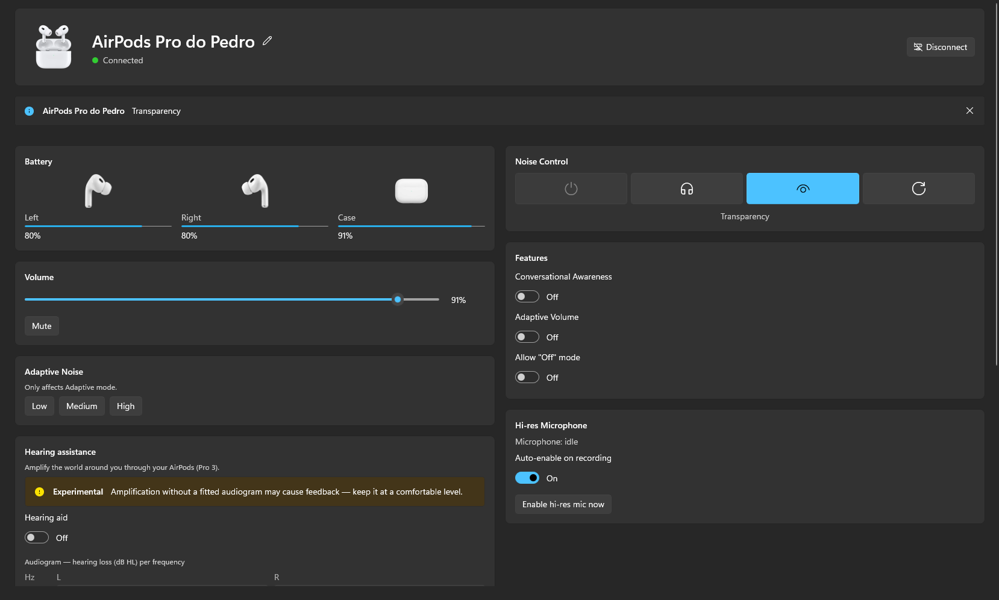
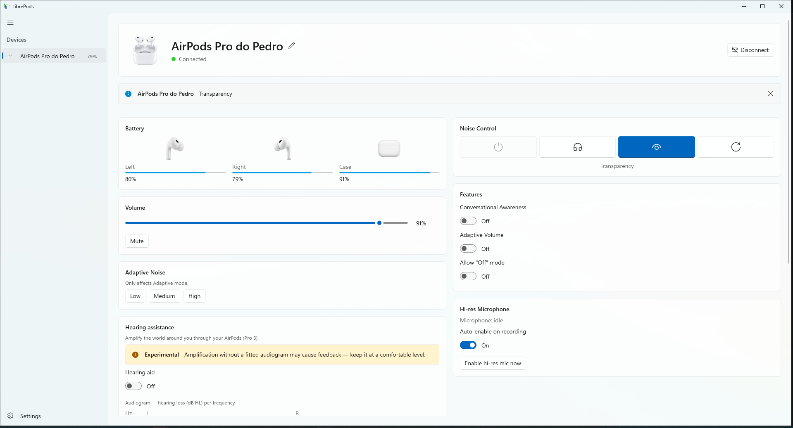
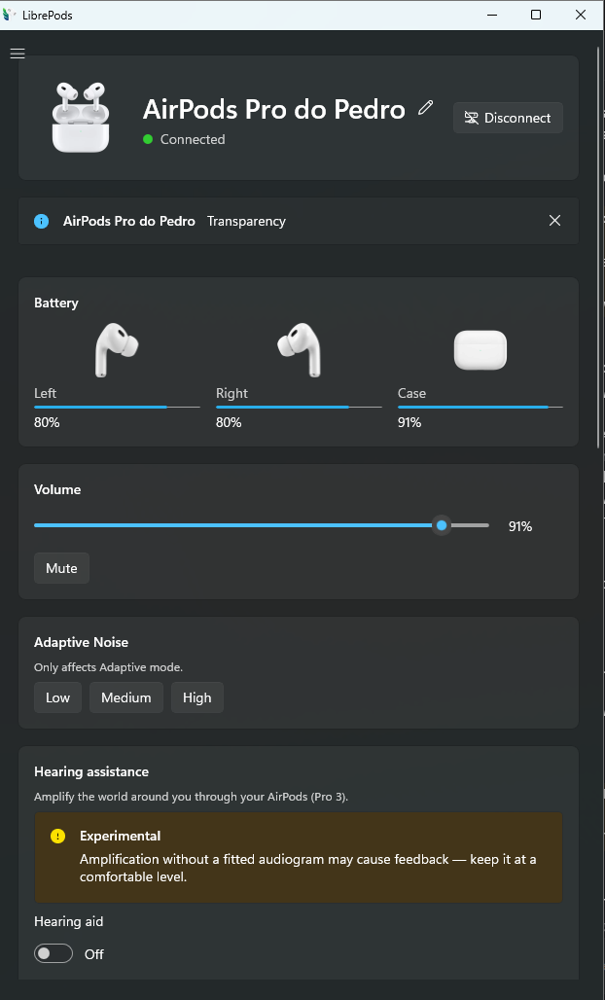
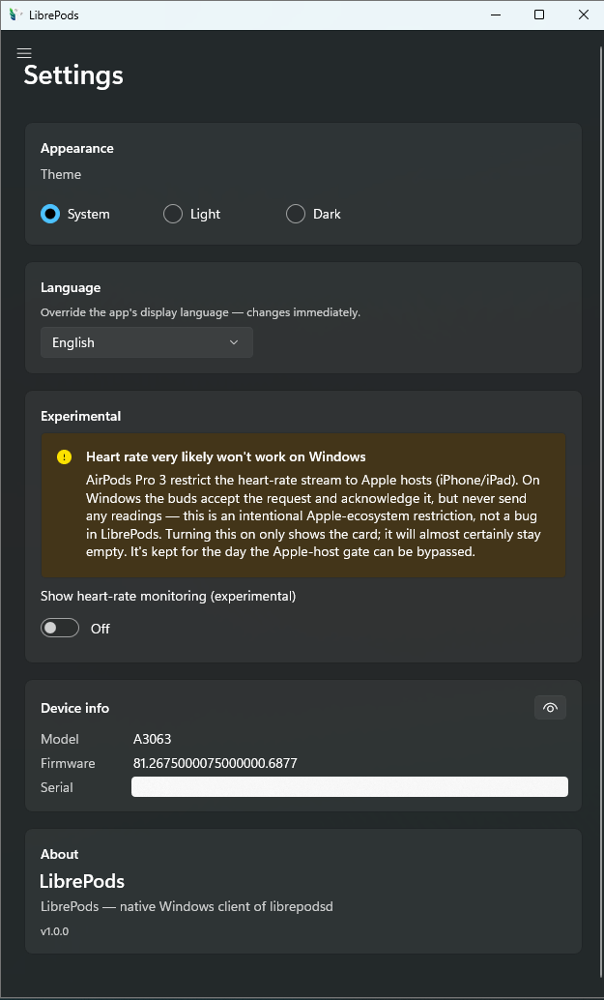
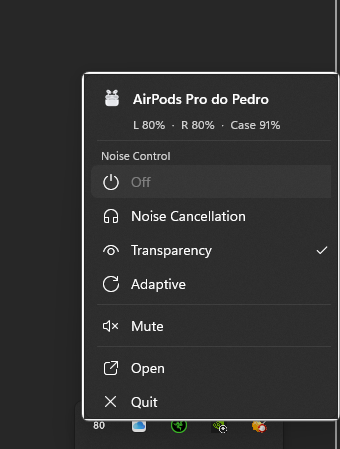
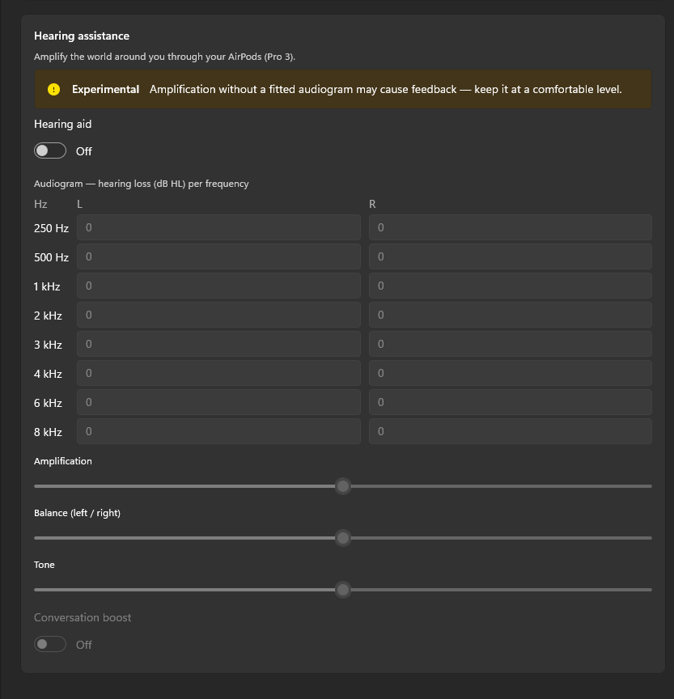
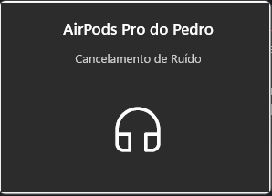

# LibrePods — WinUI 3 client (`librepods-winui.exe`)



A native **C# / WinUI 3 (Windows App SDK)** front-end for LibrePods.

## Screenshots

| | |
|---|---|
|  |  |
| The device page in the light theme | Responsive: one column when narrow |
|  |  |
| Settings (theme, language, experimental) | Tray menu (battery + Noise Control + Mute) |
|  |  |
| Hearing aid controls | iOS-style connection island |
 It is the Windows client — a thin IPC client of the Rust daemon,
**`librepodsd.exe`**, which owns the drivers, the AAP session and the hi-res mic.
(An earlier lightweight Rust tray was retired; this app carries its own tray.)

This app is **primarily a tray app**:

- It starts **hidden to the system tray**.
- Left-click the tray icon (or **Open** in its menu) shows the main window.
- Closing the window **hides it back to the tray** — it does not exit.
- **Quit** in the tray menu exits the app and shuts the daemon down with it.

## What it talks to

Two one-directional Windows named pipes (see `../ipc/src/lib.rs`):

| Pipe | Direction | Purpose |
|------|-----------|---------|
| `LibrePods-events` | daemon → app (read) | newline-delimited JSON events (`state` / `overlay` / `connect_prompt`) |
| `LibrePods-cmds`   | app → daemon (write) | newline-delimited JSON commands (`hello`, `set_anc`, …) |

If the daemon isn't running when the app starts, it launches the sibling
`librepodsd.exe` (from `AppContext.BaseDirectory`) and retries every 500 ms. Put
`librepods-winui.exe` next to the other LibrePods exes (the `dist/` layout).

All pipe I/O is fully asynchronous (`ConnectAsync` / `ReadLineAsync` /
`WriteAsync`) on background loops; snapshots are marshalled to the UI thread via
`DispatcherQueue`.

## Prerequisites

- **Windows 10 1809 (17763)+ or Windows 11**, x64.
- **Visual Studio 2022 (17.11+)** with the **.NET Desktop Development** workload
  and the **Windows App SDK C# templates** component, *or* a standalone MSBuild
  plus the SDKs below.
- **.NET 10 SDK** (LTS).
- **Windows 10 SDK (10.0.19041.0)** or newer (pulled in by the build tools
  package, but the matching Windows SDK must be installed).
- NuGet restore reaches nuget.org for the packages below.

## Pinned versions

| Component | Version |
|-----------|---------|
| Target framework | `net10.0-windows10.0.19041.0` (min `10.0.17763.0`) |
| .NET SDK | **.NET 10** (LTS) |
| `Microsoft.WindowsAppSDK` | **1.7.250606001** |
| `Microsoft.Windows.SDK.BuildTools` | **10.0.26100.4188** |
| `H.NotifyIcon.WinUI` | **2.3.0** |
| RuntimeIdentifier | `win-x64` |

The project is **unpackaged** (`WindowsPackageType=None`) and **self-contained**
(`WindowsAppSDKSelfContained=true`, `SelfContained=true`), so the output is a
plain `.exe` with the WinUI/WinAppSDK and .NET runtimes carried alongside — no
MSIX, no machine-wide runtime install.

> If NuGet cannot resolve an exact version above (feeds drift over time), bump to
> the newest stable of the same major/minor — the code only uses stable public
> API (`TaskbarIcon`, `MicaBackdrop`, `AppWindow`, `NamedPipeClientStream`,
> `System.Text.Json`).

## Build

From this `winui/` directory (the folder with the `.sln`):

```powershell
# Restore + build (Release, x64)
dotnet build LibrePods.WinUI.sln -c Release -p:Platform=x64
```

or, to produce the self-contained unpackaged output explicitly:

```powershell
dotnet publish LibrePods.WinUI\LibrePods.WinUI.csproj -c Release -r win-x64 --self-contained true
```

With MSBuild directly:

```powershell
msbuild LibrePods.WinUI.sln /t:Restore,Build /p:Configuration=Release /p:Platform=x64
```

The executable is emitted as **`librepods-winui.exe`** under
`LibrePods.WinUI\bin\x64\Release\net10.0-windows10.0.19041.0\win-x64\`
(`publish\` for the `dotnet publish` command). Copy it — plus its runtime files —
next to `librepodsd.exe`.

## Run

```powershell
.\librepods-winui.exe
```

It appears in the tray, connects to (or launches) `librepodsd.exe`, and renders
the state. The **Switch default UI to iced** button writes
`%LOCALAPPDATA%\LibrePods\ui.pref` = `iced`, so the tray's "Open App" launches
the iced front-end by default next time.

## Project layout

```
winui/
  LibrePods.WinUI.sln
  LibrePods.WinUI/
    LibrePods.WinUI.csproj
    app.manifest
    App.xaml / App.xaml.cs          bootstrap; wires tray + DaemonClient
    MainWindow.xaml / .xaml.cs      Fluent UI (Mica, light/dark aware)
    Ipc/
      Messages.cs                   Snapshot/Battery DTOs, command DTOs, event parser
      DaemonClient.cs               async named-pipe client + reconnect + daemon spawn
    Tray/
      TrayIcon.cs                   H.NotifyIcon.WinUI tray icon + Open/Quit menu
    Services/
      UiPreference.cs               read/write %LOCALAPPDATA%\LibrePods\ui.pref
    Assets/
      app.ico  tray.ico  icon.png   LibrePods icon (window / tray / app)
      airpods.png                    AirPods product image for the device card
```

## Localization

UI strings are externalized to `Strings/en-US/Resources.resw` (the base language).
Two mechanisms use it:

- **XAML** labels carry `x:Uid` — the framework resolves `<Uid>.Text` /
  `.Content` / `.Header` against the `.resw` automatically (no code).
- **Runtime** strings (connection status, mute/unmute, the tray menu, toasts) are
  fetched in code via `Services/Localize.cs` (`Localize.Get("Key")`), a thin
  wrapper over the Windows App SDK `ResourceLoader`.

To add a language, copy `Strings/en-US` to `Strings/<lang>` (e.g. `Strings/pt-PT`)
and translate the `<value>`s — the build merges them into `resources.pri` and the
OS display language selects the match at runtime. `en-US` stays the fallback
(`<DefaultLanguage>` in the csproj).

## Visual identity

The UI follows the LibrePods look (Android app + iced app), adapted to native
Fluent: a **Mica** backdrop, rounded cards for the device/battery/sections, the
AirPods product image in the device header, and the LibrePods brand accent
(`#039BE5`, the Android app's `light_blue_600`) applied to the progress bars and
Fluent accent controls. It is light/dark-theme aware via system theme resources.
